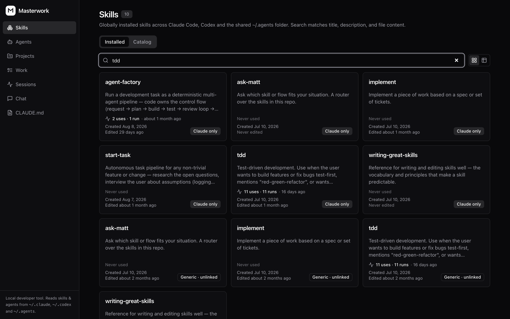
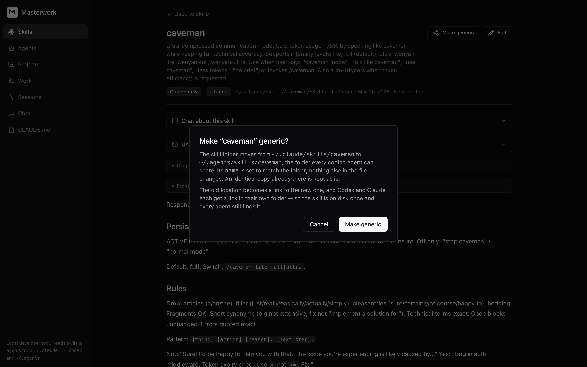
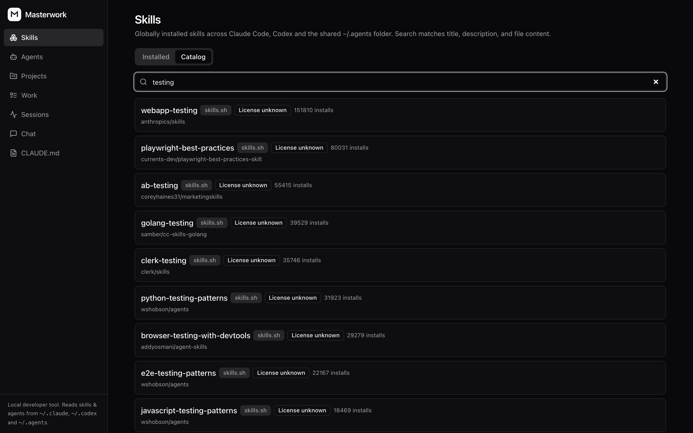
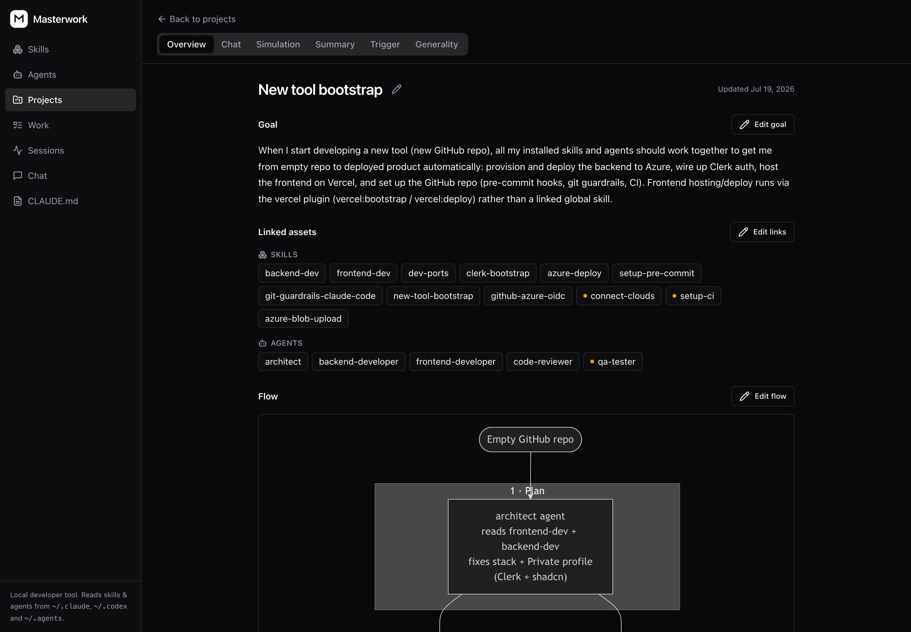
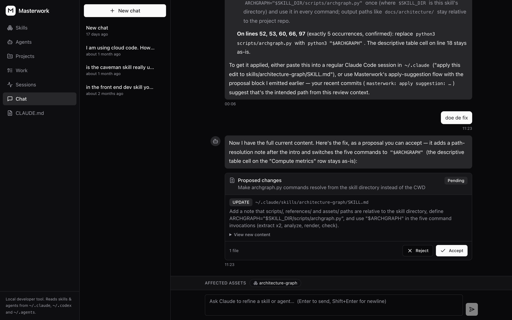
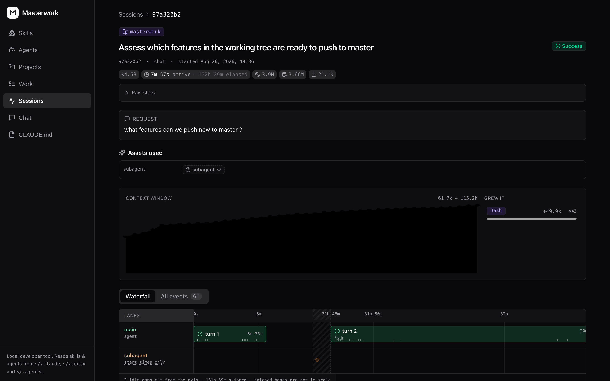
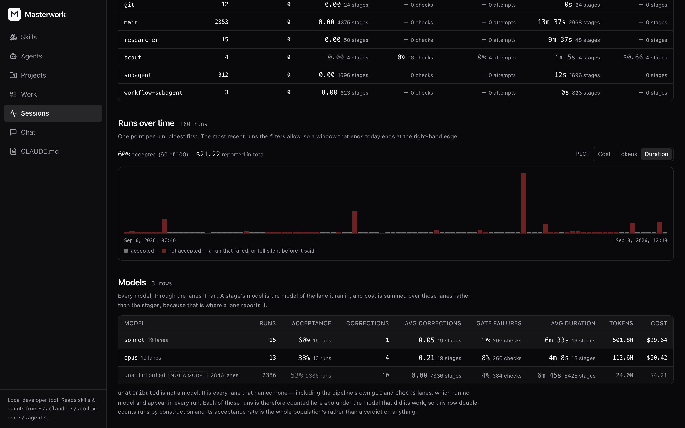

# Masterwork

[](https://www.npmjs.com/package/masterwork)
[](https://github.com/flieks/masterwork/actions/workflows/ci.yml)
[](LICENSE)

A local workbench for the skills and subagents your AI coding agents use — browse
them across Claude Code, Codex and the shared `~/.agents` folder, edit them,
refine them with AI, and **prove they work** with scored simulation runs.

Writing a skill is easy. Knowing whether it actually fires at the right moment,
does the right thing, and doesn't quietly overfit to the one example you wrote it
against — that's the hard part. Masterwork is built for that second half.

> Runs entirely on your machine. Your skills never leave it.


## What it does

- **Browse & edit** every skill and subagent installed on your machine, with
  search, diffs, and git-backed snapshots of every change.
- **Every agent's folder, one list** — Claude Code reads `~/.claude`, Codex reads
  `~/.codex`, and neither looks in the other's. Each skill is badged with the
  agents that actually load it, so a copy nothing reads is visible instead of
  silent.
- **Install from the catalog** — search skills.sh and GitHub's `claude-skills`
  topic in one box, read the `SKILL.md` before you commit to it, and install.
  Unlicensed skills say so and take a second click.
- **Simulate** — run a skill against a scenario, score the result against a
  checklist, and see exactly which criteria it missed. Re-run after edits to
  confirm the fix.
- **Generality audit** — catch skills that were tuned to one example and won't
  survive contact with a different repo.
- **Chat to refine** — describe the change you want; the assistant proposes a
  concrete diff you accept or reject. It never writes files on its own.
- **Projects** — group assets around a goal, with generated summaries and Mermaid
  diagrams of how they fit together.
- **Sessions** — record the runs your coding agents actually do, Claude Code
  and Codex alike: which skills and subagents each one used, where the time
  went, what it cost. One click per agent to switch on.
- **Work** — your backlog next to the pull requests waiting on you, with each
  PR's review comments read in place and handed to a fresh coding session to
  answer.
- **Global instructions** — edit your agent's root instructions file in the same
  place as everything else.



## Requirements

- macOS or Linux
- Python 3.13+ and [uv](https://docs.astral.sh/uv/)
- Node 20+
- The [Claude Code](https://claude.com/claude-code) CLI, signed in
- Codex is optional: its skills folder is read when it exists, and its sessions
  can be recorded once it has run on the machine (`~/.codex` exists)

No database server needed — it uses SQLite at `~/.masterwork/masterwork.db` and
stores only chat sessions and simulation history. Your skills stay on disk.
Postgres is supported too: set `DATABASE_URL` and the same migrations apply.

The built-in assistant shells out to your local `claude` binary, so it runs on
your existing subscription. **No API key, no inference bill.**

## Quick start

```bash
npx masterwork
```

That's it — nothing to clone. It installs what it needs, migrates the database,
starts both servers and opens the browser. Ctrl-C stops everything.

<details>
<summary>From a clone, if you want to hack on it</summary>

```bash
git clone https://github.com/flieks/masterwork.git
cd masterwork
npm start          # same launcher
```

Or run the two servers yourself:

```bash
cd backend
uv sync
uv run alembic upgrade head
uv run uvicorn app.main:app --reload --port 8008

# in a second terminal
cd frontend
npm install
npm run dev        # http://localhost:5192
```

</details>

## Where skills live

`SKILL.md` is the same file for every agent, but each agent reads only its own
folder: Claude Code `~/.claude/skills`, Codex `~/.codex/skills`. The way to share
one is `~/.agents/skills`, the folder each agent links into its own.

Masterwork lists all three and says which agents load each skill — **Claude
only**, **Generic · Claude, Codex**, or **Generic · unlinked** for a shared copy
nothing links to yet. **Make generic** does the move: the folder goes to
`~/.agents/skills`, the old location becomes a link to it, and every other agent
gets a link too, so the skill is on disk once and every agent still finds it. An
identical copy already in the shared folder is adopted instead of duplicated; a
copy that differs stops and asks before anything is overwritten.



## Community catalog

The **Catalog** tab searches skills.sh and GitHub's `topic:claude-skills` at once,
merges the results, and shows you the `SKILL.md` before you install anything.
Licensing is on the card: a GitHub repo with no license means all rights
reserved, not unknown, so installing one takes a second click that names the
risk. Uninstall only removes what masterwork installed, never a skill you wrote.



## Projects

A project is a goal plus the skills and agents that serve it. Masterwork writes a
summary and a Mermaid flow of how they fit together, and simulates the whole set
against the goal in one run — so "these twelve should take me from empty repo to
deployed product" becomes a claim you can test rather than a hope.



## Refine by chat

Describe the change you want; the assistant reads the file and answers with a
proposal — one diff per file, with Accept and Reject under it. Its tools are
read-only, so nothing lands until you accept, and what you accept is committed as
a git snapshot in the folder it edited.



## Work

The **Work** screen puts your Azure DevOps backlog next to the pull requests
waiting on you, read-only — masterwork never writes back. A PR's unresolved review
comments can be handed to a fresh coding session in the repo they belong to, with
the comments quoted into the prompt and a rule that it may not push.

*No screenshot for this one: the only real data on that screen is client work.*

## Session recording

The **Sessions** screen is empty until a coding agent tells masterwork that a
run happened. Open it and click **Connect** next to the agent — that is the
whole setup. For Claude Code it:

- copies a small forwarder script to `~/.masterwork/hooks/`,
- adds eight hooks to `~/.claude/settings.json` that run it (backing the file up
  to `settings.json.masterwork.bak` first),
- leaves every other hook in that file exactly as it was.

Codex gets the same treatment with its own forwarder and nine hooks in
`~/.codex/hooks.json`; `config.toml` is never written. From then on each session
posts its start, prompts, tool calls, subagent spawns, the moments it goes
blocked on you, and its exit to `http://localhost:8008/api/v1/hooks/events`, and
every run is badged with the agent that ran it. **Disconnect** in the same place
removes those entries and nothing else; the runs already recorded are kept.

Nothing is installed without that click, and nothing is sent anywhere but your
own machine. Prefer the terminal?

```bash
cd backend && uv run python -m app.observability.cli connect
```



Across runs, the **Analytics** tab totals one population four ways — the gates
that failed, the roles that ran, the models behind them, and every run over time.
Which model actually gets its work accepted is a number here, not a hunch.



Claude Code and Codex are the agents wired up today. `SKILL.md` is an open
standard and so is this: an agent that can run a command on session events is
an `Integration` implementation in `backend/app/observability/` and a line in
its registry — the API, the screen and the button already handle the rest.

## How it works

```
frontend/   React + Vite + TS · Jotai + jotai-tanstack-query · react-router-dom · shadcn/ui
            API client generated (typescript-axios) from the backend's /openapi.json
backend/    FastAPI · Pydantic v2 · SQLAlchemy 2.0 async · Alembic · uv
            - assets:        scans every skills root (~/.claude, ~/.codex, ~/.agents)
            - skills:        community catalog search, install and uninstall
            - instructions:  the global CLAUDE.md
            - chat:          claude -p subprocess runner, proposals, apply-changes
            - simulations:   scored dry-runs with checklist grading and run memory
            - sessions:      hook ingest, plus the per-agent wiring that installs it
            - work:          the backlog and pull requests, delegated to sessions
docs/       SPEC.md (product spec) · API_CONTRACT.md (the v1 API contract)
```

The files on disk are the source of truth. The database holds chat sessions and
simulation history — nothing that can't be rebuilt.

## Safety model

This tool edits files in your home directory, so the boundaries are explicit:

- The assistant is given **read-only tools**. It cannot write anything.
- The only file outside masterwork's own home it ever writes is your agent's
  hook config, only when you click **Connect**, and only after backing it up.
- Every change arrives as a **proposal** you review and accept.
- Applies are performed by the backend, against a validated path allowlist.
- Each accepted change is committed as a git snapshot, so you can always go back.
- Secrets found in the files being read are redacted before they reach the model.

No auth, no multi-user: this is a single-user tool bound to localhost.

## Roadmap

- **More agents.** Claude Code and Codex are read and recorded today; Cursor
  and Gemini CLI are not read at all. Assets route through a provider
  abstraction and session recording through an integration one, so adding an
  agent to either is the natural first contribution.
- **A faster first run.** `npx masterwork` currently runs the frontend through
  Vite's dev server, so the very first launch waits on a full install. Shipping a
  pre-built frontend would cut that to seconds.
- **A hub.** Pulling from the community catalog works; publishing back does not.
  Skills, subagents and projects, with simulation scores attached, so you can see
  what a skill actually does before installing it.

Issues and PRs welcome, especially for the first item.

## Development

Backend tests (integration tests use a throwaway `masterwork_test` database):

```bash
cd backend && uv run pytest
```

Frontend tests (Playwright component + E2E):

```bash
cd frontend && npm run test:ct && npm run test:e2e
```

Local dev-server setup, including the optional launchd services used on macOS,
is documented in [docs/DEV_SETUP.md](docs/DEV_SETUP.md).

## Credits

The `factory/` pipeline — staged agent runs with typed envelopes, per-stage write
boundaries and deterministic gates — takes its shape from
[disler/super-simple-software-factory](https://github.com/disler/super-simple-software-factory)
by [IndyDevDan](https://www.youtube.com/@indydevdan). `SSSF` in a couple of code
comments refers to that repo. The code here is ours; the idea to structure it
this way is not.

## License

[Elastic License 2.0](LICENSE): free to use, self-host, and modify. You may not
offer Masterwork (or a substantial part of it) to third parties as a hosted or
managed service.
