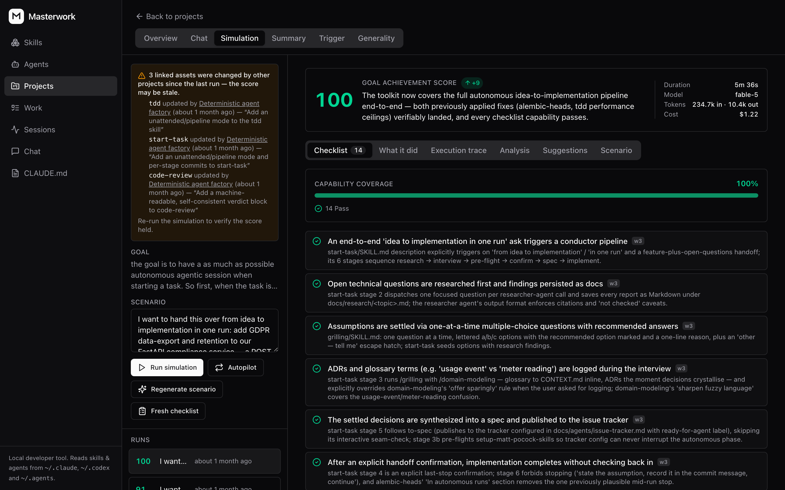

# Masterwork

[](https://www.npmjs.com/package/masterwork)
[](https://github.com/flieks/masterwork/actions/workflows/ci.yml)
[](LICENSE)

A local workbench for the skills and subagents your AI coding agent uses — browse
them, edit them, refine them with AI, and **prove they work** with scored
simulation runs.

Writing a skill is easy. Knowing whether it actually fires at the right moment,
does the right thing, and doesn't quietly overfit to the one example you wrote it
against — that's the hard part. Masterwork is built for that second half.

> Runs entirely on your machine. Your skills never leave it.



## What it does

- **Browse & edit** every skill and subagent installed on your machine, with
  search, diffs, and git-backed snapshots of every change.
- **Simulate** — run a skill against a scenario, score the result against a
  checklist, and see exactly which criteria it missed. Re-run after edits to
  confirm the fix.
- **Generality audit** — catch skills that were tuned to one example and won't
  survive contact with a different repo.
- **Chat to refine** — describe the change you want; the assistant proposes a
  concrete diff you accept or reject. It never writes files on its own.
- **Projects** — group assets around a goal, with generated summaries and Mermaid
  diagrams of how they fit together.
- **Global instructions** — edit your agent's root instructions file in the same
  place as everything else.

## Requirements

- macOS or Linux
- Python 3.13+ and [uv](https://docs.astral.sh/uv/)
- Node 20+
- The [Claude Code](https://claude.com/claude-code) CLI, signed in

No database server needed — it uses SQLite at `~/.masterwork/masterwork.db` and
stores only chat sessions and simulation history. Your skills stay on disk.
Postgres is supported too: set `DATABASE_URL` and the same migrations apply.

The built-in assistant shells out to your local `claude` binary, so it runs on
your existing subscription. **No API key, no inference bill.**

## Quick start

```bash
npx masterwork
```

That's it — nothing to clone. It installs what it needs, migrates the database,
starts both servers and opens the browser. Ctrl-C stops everything.

<details>
<summary>From a clone, if you want to hack on it</summary>

```bash
git clone https://github.com/flieks/masterwork.git
cd masterwork
npm start          # same launcher
```

Or run the two servers yourself:

```bash
cd backend
uv sync
uv run alembic upgrade head
uv run uvicorn app.main:app --reload --port 8008

# in a second terminal
cd frontend
npm install
npm run dev        # http://localhost:5192
```

</details>

## How it works

```
frontend/   React + Vite + TS · Jotai + jotai-tanstack-query · react-router-dom · shadcn/ui
            API client generated (typescript-axios) from the backend's /openapi.json
backend/    FastAPI · Pydantic v2 · SQLAlchemy 2.0 async · Alembic · uv
            - assets:       scans provider roots (~/.claude/skills, ~/.claude/agents)
            - instructions: the global CLAUDE.md
            - chat:         claude -p subprocess runner, proposals, apply-changes
            - simulations:  scored dry-runs with checklist grading and run memory
docs/       SPEC.md (product spec) · API_CONTRACT.md (the v1 API contract)
```

The files on disk are the source of truth. The database holds chat sessions and
simulation history — nothing that can't be rebuilt.

## Safety model

This tool edits files in your home directory, so the boundaries are explicit:

- The assistant is given **read-only tools**. It cannot write anything.
- Every change arrives as a **proposal** you review and accept.
- Applies are performed by the backend, against a validated path allowlist.
- Each accepted change is committed as a git snapshot, so you can always go back.
- Secrets found in the files being read are redacted before they reach the model.

No auth, no multi-user: this is a single-user tool bound to localhost.

## Roadmap

- **More agents.** `SKILL.md` is an open standard — Codex, Cursor, Gemini CLI and
  others read the same files. The backend already routes through a provider
  abstraction; adding a provider is the natural first contribution.
- **A faster first run.** `npx masterwork` currently runs the frontend through
  Vite's dev server, so the very first launch waits on a full install. Shipping a
  pre-built frontend would cut that to seconds.
- **A hub.** Publish and pull skills, subagents and projects — with simulation
  scores attached, so you can see what a skill actually does before installing it.

Issues and PRs welcome, especially for the first item.

## Development

Backend tests (integration tests use a throwaway `masterwork_test` database):

```bash
cd backend && uv run pytest
```

Frontend tests (Playwright component + E2E):

```bash
cd frontend && npm run test:ct && npm run test:e2e
```

Local dev-server setup, including the optional launchd services used on macOS,
is documented in [docs/DEV_SETUP.md](docs/DEV_SETUP.md).

## License

MIT — see [LICENSE](LICENSE).
